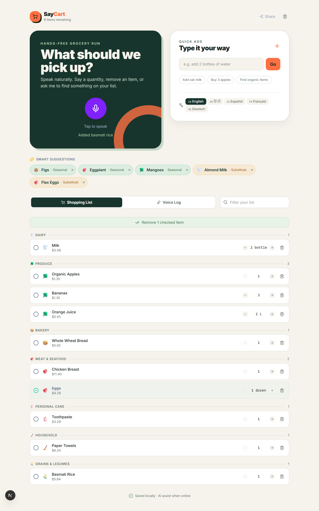
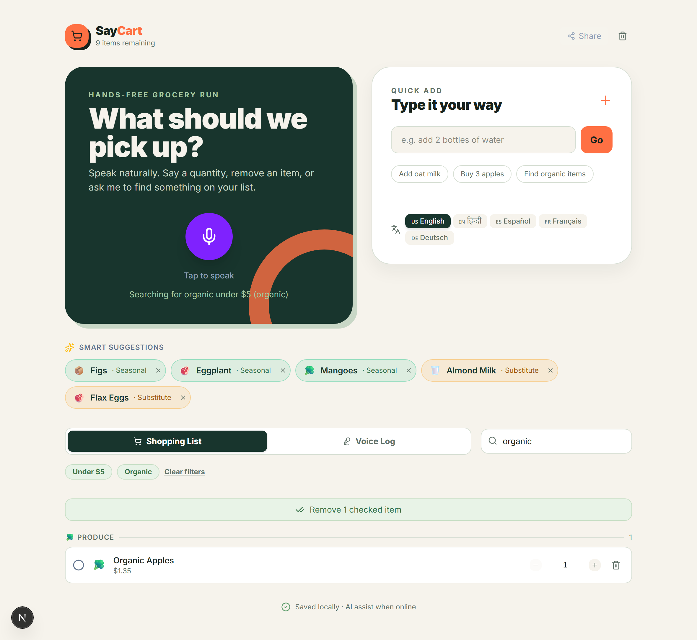
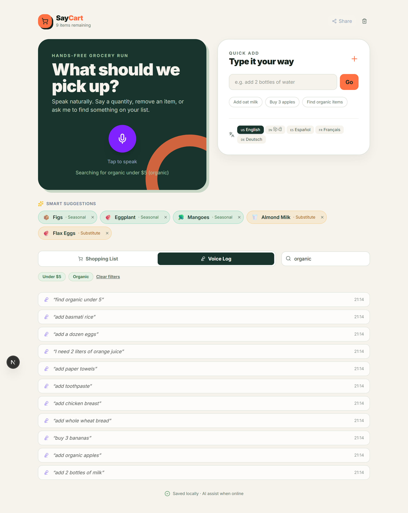
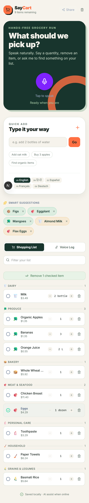

# 🛒 Voice Shopping Assistant

A voice-powered shopping list manager with smart suggestions, multilingual support, and offline capability — built as a technical assessment project.

**Live Demo:** [voice-shopping-assistant-self.vercel.app](https://voice-shopping-assistant-self.vercel.app/)

---

## 📸 Screenshots

| Shopping list | Price & attribute filters |
|---|---|
|  |  |

| Voice command log | Mobile view |
|---|---|
|  |  |

---

## ✨ Features

### Assessment approach
SayCart is intentionally local-first: the browser-native Web Speech API handles recognition, while a typed command fallback keeps the core workflow testable when microphone permissions or browser support are unavailable. Both entry points use the same interpreter pipeline, so a command behaves consistently whether it is spoken or typed. The app stores the list and purchase history locally, avoiding account setup while still providing a realistic installable experience.

### 🎙️ Voice Input
- **Natural language commands**: "Add milk", "I need 3 bottles of water", "Remove bread from my list"
- **Real-time waveform visualizer** using Web Audio API AnalyserNode (live mic data, not fake animation)
- **Quantity parsing**: "Buy 5 oranges" → qty: 5, "Add two dozen eggs" → qty: 24
- **Unit support**: kg, g, lb, litres, bottles, cans, packs, loaves…

### 🌍 Multilingual Support
| Language | Code | Trigger words |
|----------|------|---------------|
| English  | en-US | add, buy, remove, find… |
| Hindi    | hi-IN | जोड़ो, खरीदो, हटाओ… |
| Spanish  | es-ES | añadir, quitar, buscar… |
| French   | fr-FR | ajouter, enlever, chercher… |
| German   | de-DE | hinzufügen, entfernen, suchen… |

### 🧠 Smart Suggestions
Three independent suggestion layers:

| Layer | Mechanism |
|-------|-----------|
| **History-based** | Frequency + recency weighted items from localStorage purchase history |
| **Seasonal** | Month-aware produce + holiday-triggered items (within 7 days of event) |
| **Substitutes** | 18+ product categories mapped to healthier/allergen-free/budget alternatives |

### 📋 List Management
- **Auto-categorization**: 12 categories (Dairy, Produce, Bakery, Meat, Frozen…)
- **Smart dedup**: Adding an existing item increments quantity instead of creating a duplicate
- **Bulk actions**: Clear checked items in one tap
- **Voice command log**: Every recognized phrase is timestamped and logged
- **Typed command fallback**: Run the same add, remove, check, clear, and search intents without a microphone
- **Live list filter**: Search the current list by typing or saying "find ..."
- **Price & attribute search**: "Find toothpaste under $5" or "find organic items" filters by an estimated per-item price and dietary/attribute tags (organic, vegan, gluten-free…) parsed from the item name; active filters show as clearable pills above the list

### 🔗 Shareable Lists
Encode the full shopping list as a URL query parameter — anyone with the link can open it in their browser (no account needed).

### 📱 Progressive Web App (PWA)
- Installable on mobile (Add to Home Screen)
- List works **offline** — localStorage-persisted items survive connectivity loss; Gemini interpretation and browser speech recognition require internet
- Mobile-first, viewport-locked, optimized touch targets

---

## 🛠️ Tech Stack

| Technology | Purpose |
|-----------|---------|
| Next.js 16 (App Router) | Framework + SSR |
| TypeScript | Type safety |
| Tailwind CSS v4 | Styling |
| Framer Motion | Animations |
| Web Speech API | Voice recognition (free, browser-native) |
| Web Audio API | Live waveform visualization |
| localStorage | List + history persistence |
| Vercel | Hosting + CI/CD |

---

## 🏗️ Architecture

```
src/
├── app/                    # Next.js App Router
│   ├── api/interpret/      # Optional Gemini-backed NLP fallback route
│   ├── layout.tsx          # Root layout (PWA meta, font)
│   └── page.tsx            # Main orchestration page
├── components/
│   ├── VoiceInput.tsx      # Mic button + transcript display
│   ├── WaveformVisualizer  # Real-time audio bars (Web Audio API)
│   ├── ShoppingList.tsx    # Category-grouped list container
│   ├── ShoppingItemCard    # Individual item with quantity controls
│   ├── SuggestionChips     # Smart suggestion pills
│   ├── LanguageSelector    # 5-language switcher
│   └── ShareButton.tsx     # Web Share API + copy link fallback
├── hooks/
│   ├── useVoiceRecognition # Web Speech API wrapper
│   └── useShoppingList     # useReducer + localStorage persistence
└── lib/
    ├── nlp/intentParser    # Custom intent+entity extraction engine
    ├── categories.ts       # Keyword-based item categorization
    ├── pricing.ts          # Deterministic estimated pricing (no backend catalog)
    ├── suggestions/
    │   ├── historyEngine   # Frequency/recency-weighted history
    │   ├── seasonalEngine  # Month + holiday-based suggestions
    │   └── substitutesDB   # Product alternative database
    └── i18n/languages      # Language configs + keyword maps
```

---

## 🧪 Technical Approach

> Built with Next.js 16, TypeScript, and Tailwind CSS. The app uses the browser-native Web Speech API for voice recognition — requiring no external API keys or costs — making it instantly deployable and free to use.
>
> The NLP layer is a custom intent parser built on pattern matching. It extracts intents (ADD/REMOVE/SEARCH/CHECK/CLEAR), entities (item names), quantities, an estimated price ceiling, and attribute tags from natural language phrases without relying on a cloud NLP service, keeping latency under 50ms and working completely offline.
>
> Smart suggestions are powered by a three-layer engine: a frequency-based history engine (items you buy most), a seasonal engine (current month's produce/holidays), and a substitutes database (common product alternatives). List data and history live in localStorage; the optional Gemini route is used only for broad-language interpretation.
>
> Multilingual support uses the Web Speech API's lang attribute across 5 languages with per-language intent keyword maps, enabling natural commands in English, Hindi, Spanish, French, and German.
>
> The app is a Progressive Web App — installable on mobile, keeps the shopping list available offline, and provides a native-like experience. Gemini interpretation and browser speech recognition use network services when enabled. Deployed on Vercel with automatic CI/CD from GitHub.

## 📝 Submission write-up (under 200 words)

SayCart is an offline-first voice shopping assistant built with Next.js, TypeScript, and browser-native speech APIs. Users can add, remove, check, and clear items with natural phrases such as "add two bottles of water" or "remove bread". A shared intent parser powers both voice input and the typed fallback, extracting quantities, units, search filters, and multilingual trigger words consistently. Items are automatically categorized, duplicate products increase quantity, and the command log makes recognition behavior visible.

Smart suggestions combine local purchase history, month-aware seasonal produce, and a substitute database. The list and history are stored in localStorage, so the app works without accounts, API keys, or a backend and remains usable offline after loading. A share action encodes a list into a URL for quick handoff. The interface is mobile-first, keyboard-accessible, and gives immediate feedback through transcripts, a live waveform, action status, loading states, and browser capability errors. This keeps the MVP deployable on Vercel while leaving clear extension points for a product catalog or server-backed recommendations.

---

## 🚀 Getting Started

### Prerequisites
- Node.js 18+
- **Chrome or Edge** (required for the Web Speech API)

### Installation

```bash
# Clone the repo
git clone https://github.com/Shub-ways/voice-shopping-assistant.git
cd voice-shopping-assistant

# Install dependencies
npm install

# Start development server
npm run dev
```

Open [http://localhost:3000](http://localhost:3000) in **Chrome or Edge**.

> ⚠️ **Important**: Voice recognition requires microphone permission and works in Chromium-based browsers. Safari has partial support; Firefox does not support the Web Speech API.

### Optional broad-language interpreter

For wider natural-language coverage, copy `.env.example` to `.env.local` and add a server-side Gemini key:

```bash
GEMINI_API_KEY=your_key_here
```

The voice flow sends only the transcript to `/api/interpret`. The key is never exposed to the browser. If the key is missing, the request fails, or the device is offline, SayCart automatically uses its local parser. The list itself remains available offline, while browser speech recognition may require an internet connection.

### Scripts

```bash
npm run dev         # Start dev server (Turbopack)
npm run build       # Production build
npm run lint        # ESLint
npm run typecheck   # tsc --noEmit
```

Run all three before submitting.

---

## 📦 Deployment

This project is deployed on **Vercel** with automatic deploys from the `main` branch.

To deploy your own instance:
1. Push to GitHub
2. Import the repo at [vercel.com/new](https://vercel.com/new)
3. Add `GEMINI_API_KEY` in Vercel project settings to enable broad-language interpretation. Without it, the local parser remains available.

---

## 🎯 Voice Command Examples

| Say this | Action |
|----------|--------|
| "Add milk" | Adds milk (qty: 1) |
| "Buy 3 apples" | Adds apples (qty: 3) |
| "I need two bottles of water" | Adds water (qty: 2, unit: bottle) |
| "Remove bread from my list" | Removes bread |
| "I got the eggs" | Checks off eggs |
| "Find organic under $5" | Filters the list to organic items priced under $5 |
| "Clear my list" | Clears everything |
| "जोड़ो दूध" | Adds milk (Hindi) |
| "Añadir manzanas" | Adds apples (Spanish) |

---

## 📄 License

MIT — free to use and modify.
